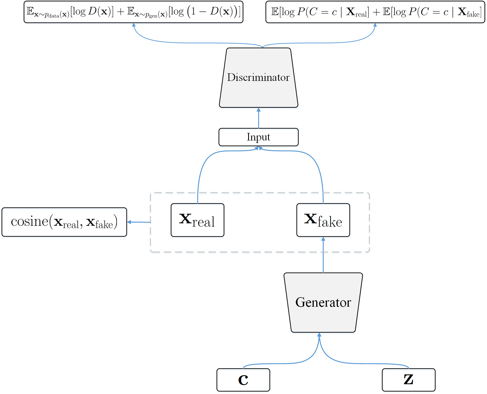
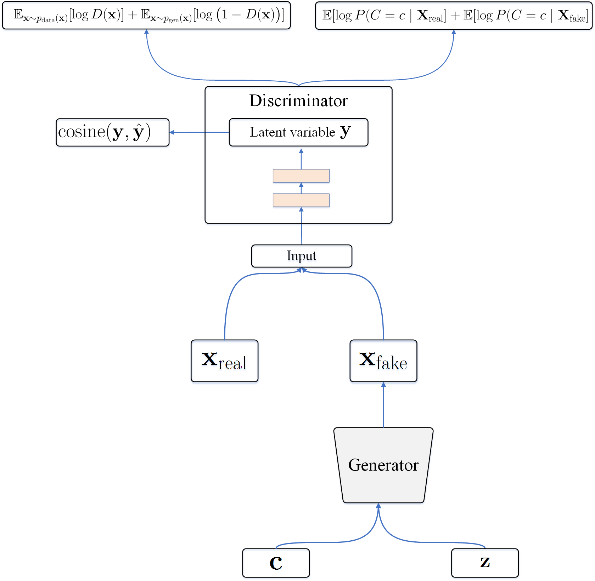
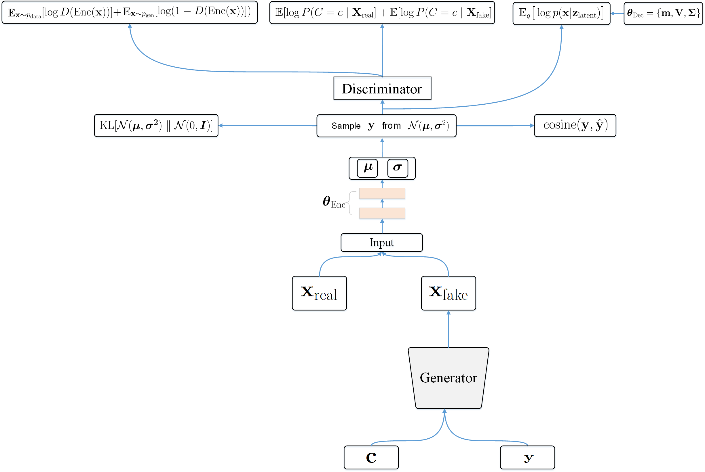

# Generative Adversarial Networks for Data Augmentation on Speaker Recognition
In this project, we implement three GANs model for data augmentation on speaker recognition.

You need to download NIST 2014 i-vector Machine Learning Challenge. Convert the format of data into numpy array and put it to NIST_npy/.

The dataset.py is used to handle the dataset  (ex. next_batch, sort, add), If everything is ready, execute main.py to start training.

After the training is completed, you can run generate.ipynb to restore model and generate data.

# Architecture

## GAN-Cos-Gen
  

## GAN-Cos-Gen-Disc
  

## PLDA-GAN-Cos-Gen-Disc
  

# Setting
- Ubuntu 16.04 64bit
- Python 2.7.12
- Tensorflow 1.1

# Hardware
  - Intel i7-4930K @3.40GHz
  - DDR3-1600 8GB*8
  - Nvidia GeForce GTX 980 3GB
